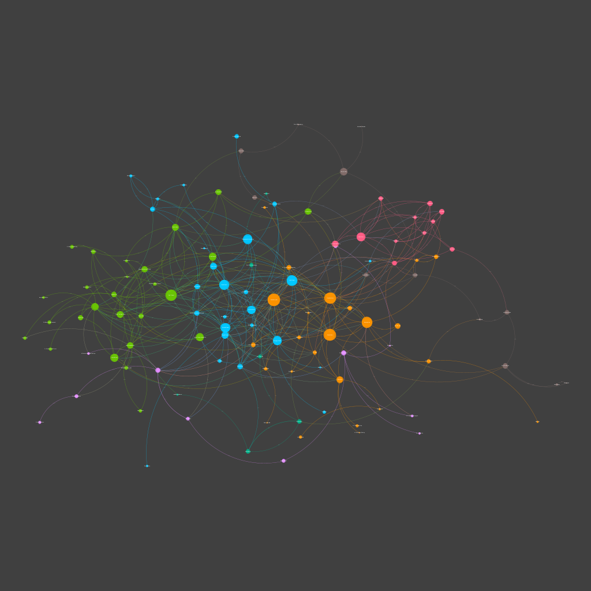

# The Consecrated Literary Network: Using Archival Metadata to Construct Literary Networks from the National Library of Australia 

## Authors 
* [Dr. Elizabeth McLean](https://arts.unimelb.edu.au/enlightenment-romanticism-contemporary-culture/people/associate-researchers/associate-researchers/dr-elizabeth-mclean)
* [Fiannuala Morgan ](https://www.fiannualamorgan.com)

This repository contains source code and data for the paper: 'The Consecrated Literary Network: : Using Archival Metadata to Construct Literary Networks from the National Library of Australia' presented at the ASAL Conference 3 July 2023.

To reproduce data:

1. Enter API key into notebook 1.get_metadata.ipynb and make ammendments to "l-occupation" search facet as required 
Difficulties with the search facet for occupation with the Trove API means that these queries have been exectuted individually
in the following order:
    1. "l-occupation": "Authors",
    2. "l-occupation": "Novelists",
    3. "l-occupation": "Poets",
    4. "l-occupation": "Journalists", #Playwrights 0?
    5. "l-occupation": "Publishers",
    6. "l-occupation": "Academics",

The output for this data can be located in the data folder. 

2. To clean data and create network, run the notebook: 2.clean_data.ipynb

3. For the presented paper manual edits were made to 'processed_df.csv' for visualisation in Gephi.

